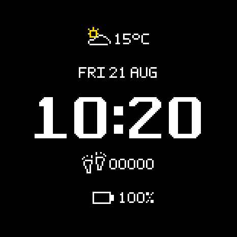
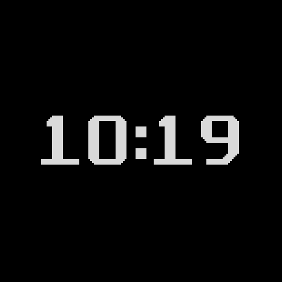
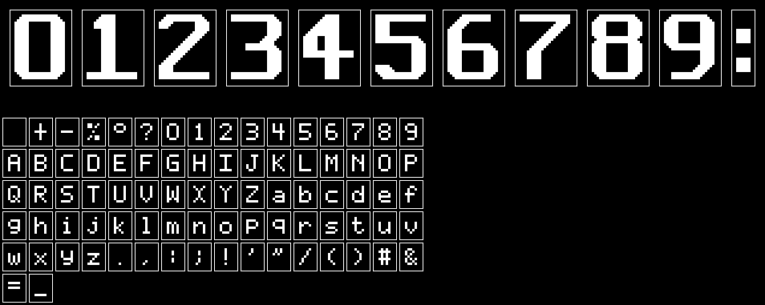
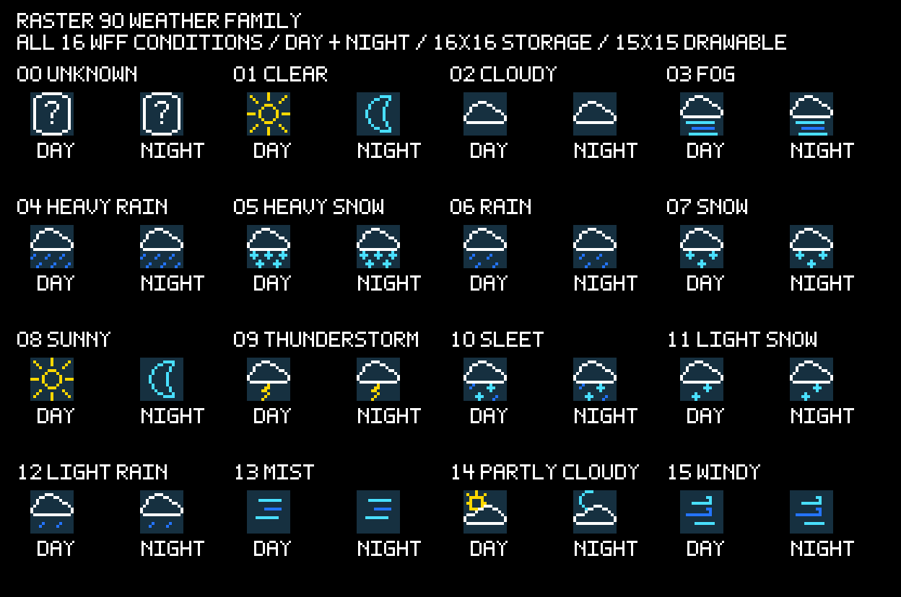
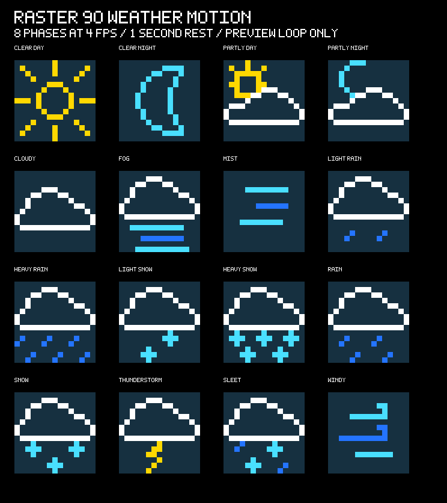
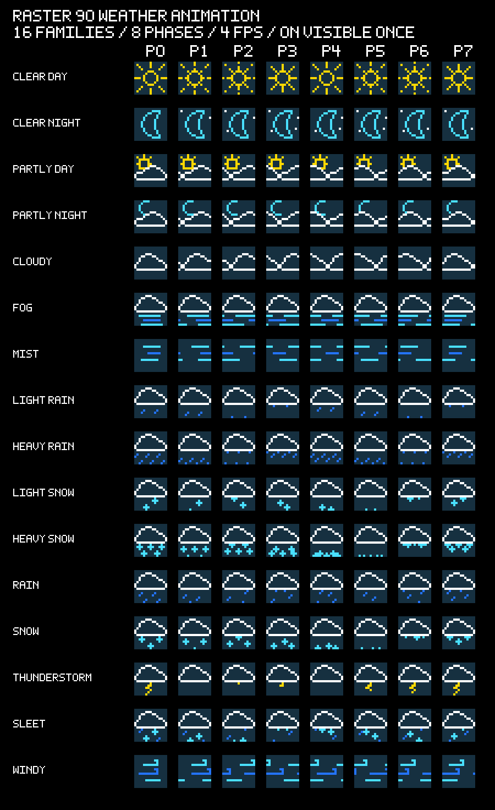

# Raster 90

<p align="center">
  <strong>A fictional 150×150 bitmap watch, built as a real Watch Face Format v2 face for Wear OS 5.</strong>
</p>

<p align="center">
  <a href="docs/watchface-design.md">Design direction</a> ·
  <a href="docs/device-setup.md">Device evidence</a> ·
  <a href="fonts/raster90/README.md">Bitmap type</a> ·
  <a href="icons/raster90/README.md">Icon family</a>
</p>

<table>
  <thead>
    <tr>
      <th>Interactive</th>
      <th>Ambient</th>
    </tr>
  </thead>
  <tbody>
    <tr>
      <td align="center">
        
      </td>
      <td align="center">
        
      </td>
    </tr>
    <tr>
      <td>2026-08-21 native emulator checkpoint; provider weather for a simulated location renders as 15°C.</td>
      <td>Confirmed <code>Dozing</code>; every non-time field is removed.</td>
    </tr>
  </tbody>
</table>

<p align="center">
  <sub>Native 466×466 WFF emulator checkpoint from <code>wear5-opw3</code> · <a href="docs/media/README.md">capture provenance</a></sub>
</p>

Raster 90 is the impossible schoolyard watch: a small, earnest device trying
to deliver graphics, color, and useful information beyond what its fictional
hardware should be able to do. It is not a modern smartwatch wearing a retro
skin. The constraints are the product.

## What makes it Raster 90

- **One physical grid.** A centered 450×450 active frame behaves as one
  fictional 150×150 framebuffer made from solid 3×3 cells with no gutter.
- **Authored pixels.** The time, compact text, and icons come from project-owned
  matrices rather than runtime TTF rasterization or resampled source art. Icon
  resources keep a stable 16×16 storage tile while reserving the final row and
  column as a transparent gutter after a 15×15 drawable field centered on cell
  `(7,7)`.
- **Truthful data.** Weather has distinct fresh, stale, and unavailable states;
  Celsius is the editable default, Fahrenheit is explicit, and provider values
  are converted rather than merely relabeled.
- **A restrained resting face.** Weather remains the indexed-color plane, while
  the battery icon gains a coarse state tint below 51%. Date, time, steps, and
  healthy battery remain white; ambient mode is time only.
- **One localized gesture.** Fresh recognized weather plays one eight-frame,
  four-fps contextual animation when it becomes visible, then returns exactly
  to the static icon. Stale, unavailable, unknown, and ambient weather stay
  still.

## Current state

The packaged runtime at `4a90116` is physically proven in an interactive state
on the native 466×466 OnePlus Watch 3. A fresh 2026-08-26 deployment rendered
the clean-chamfer time, final `four-toe-vertical` footprints, refreshed outlined
clear-night crescent, live provider weather at `18°C`, and the healthy white
battery branch without clipping. The tracked emulator gallery above remains the
2026-08-21 checkpoint that proves native/scaled emulation and confirmed Dozing;
it predates the later battery tint and weather-icon refresh. Sustained physical
AOD, low-battery color branches, battery impact, wearer-distance judgment, and
a real stale-weather state remain open. See [Device Setup](docs/device-setup.md)
for the evidence and exact limitations.

The current source tree promotes the reviewed weather-animation study into the
resource-only WFF bundle. Its exact matrices, generated frame assets, WFF v2
controller, schema validation, and memory budget are repository-checked; this
newer animated tree does not yet have a retained emulator or physical-device
capture, so the `4a90116` physical checkpoint above remains historical static-
runtime evidence.

## Authored display system

The watch-face APK packages only the glyphs and sprites its WFF expressions can
emit. The complete project-owned families remain reviewable outside the module.

<p align="center">
  
</p>

<p align="center">
  
</p>

<p align="center">
  
</p>

<p align="center">
  
</p>

The weather sheet covers all 16 WFF conditions in day and night families. The
refreshed static family uses outlined crescents, distinct fog and mist bars,
upward wind curls, stepped rain density, complete staggered snowflakes, and a
balanced rain/snow sleet pattern. The selected utility family adds the paired-
footprint steps tile, battery, neutral unavailable weather, and a compact stale
marker. Every selected icon is authored in a 15×15 drawable field centered on
cell `(7,7)` inside its 16×16 storage matrix, then rendered as solid 3×3 cells in a stable
48×48 resource tile.

The promoted motion set covers all 16 recognized day/night-resolved weather
families. Each sequence uses eight hard-cut source-cell frames at 4 fps, starts
from the corresponding static matrix, plays once on visibility, and restores
that same matrix. There is no continuous resting animation, and truthful stale
or unavailable states never animate.

## Current targets

- OnePlus Watch 3: Wear OS 5 / Android 14 / API 34
- `wear5-opw3` emulator: primary 466×466 Wear OS 5 / Android 14 / API 34
- `wear5` emulator: secondary official 454×454 scaling reference
- OnePlus 13 and `phone16`: optional future companion targets, not required for
  watch-face development

## Project map

| Area | Authority |
|---|---|
| Packaged WFF runtime | [`watchfaces/raster90/`](watchfaces/raster90/) |
| Bitmap type source and preview | [`fonts/raster90/`](fonts/raster90/README.md) |
| Icon and weather-animation source/preview | [`icons/raster90/`](icons/raster90/README.md) |
| Product and visual contract | [Watch Face Design Direction](docs/watchface-design.md) |
| Devices, deployment, and validation | [Device Setup](docs/device-setup.md) |
| Module and evidence boundaries | [Repository Layout](docs/repository-layout.md) |
| Exploratory mood artwork | [Concept Artwork](design/concepts/README.md) |

The only current Android module is `:watchfaces:raster90`, application ID
`io.github.byebyebryan.raster90.watchface`. It is a standalone resource-only
bundle with `android:hasCode="false"` and no Kotlin/Java logic. Any future Wear
or phone application logic must remain in a separately packaged Raster 90
module. Operational instructions for coding agents are in
[AGENTS.md](AGENTS.md).

## Build

Use Android Studio's bundled JBR with the committed Gradle wrapper:

```sh
JAVA_HOME=/opt/android-studio/jbr rtk proxy ./gradlew \
  :watchfaces:raster90:assembleDebug \
  :watchfaces:raster90:lintDebug
```

The debug APK is written to
`watchfaces/raster90/build/outputs/apk/debug/raster90-debug.apk`. See
[Device Setup](docs/device-setup.md) for explicit-target emulator deployment
and the current validation record. Disposable screenshots, reports, and design
studies belong in the Git-ignored root `outputs/` directory. Keep them
namespaced: Raster 90 generators use
`outputs/raster90/studies/<study>/`, device evidence uses
`outputs/raster90/captures/<checkpoint>/`, and external visual references use
`outputs/references/`. Locally downloaded validation binaries and their licenses
use `outputs/tooling/<tool>/`. The small public gallery under `docs/media/`
contains reviewed byte-for-byte copies with recorded provenance; it does not
replace the full evidence checkpoint.

Regenerate or verify the bitmap resources with:

```sh
rtk python3 -B tools/generate_raster90_assets.py
rtk python3 -B tools/generate_raster90_assets.py --check

# Generate/check the complete tracked font-family presentation.
rtk python3 -B tools/render_raster90_font_family.py
rtk python3 -B tools/render_raster90_font_family.py --check

# Generate/check the complete tracked icon-family presentation.
rtk python3 -B tools/render_raster90_icon_family.py
rtk python3 -B tools/render_raster90_icon_family.py --check
```
The generator checks the complete 215-PNG runtime surface, including 128
promoted weather-animation frames. The presentations write complete font/icon
sheets, native-scale specimens, a looping presentation GIF, the exact eight-
phase weather sheet, and self-contained local `preview/index.html` files.
