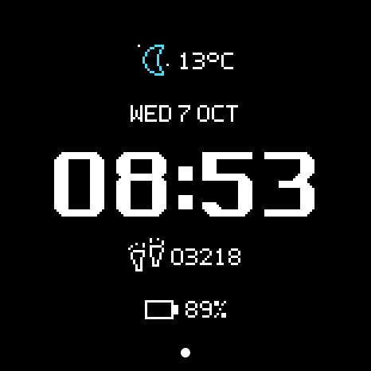

# Raster 90

**A fictional 150×150 bitmap watch for Wear OS 5 and the original Amazfit Balance.**

[Visuals and assets](https://byebyebryan.github.io/raster90/) ·
[Documentation](docs/README.md) · [Design](docs/watchface-design.md) ·
[Validation](docs/validation.md)

  

  2026-10-07 physical OnePlus Watch 3 · live weather · unretouched interactive capture · <a href="docs/media/README.md">provenance</a>

Raster 90 is the impossible schoolyard watch: a small, earnest device trying
to deliver graphics, color, and useful information beyond what its fictional
hardware should be able to do. Its constraints define the product.

- One centered 450×450 frame behaves as a 150×150 framebuffer of solid 3×3 cells.
- Time, compact text, and icons come from project-owned matrices.
- Time stays dominant; date, weather, steps, and battery each have a clear place.
- Weather carries a small flat palette; battery receives coarse state tints.
- Ambient reduces the display to monochrome time only.

Explore the complete type, icon, and motion families in the
[Visuals guide](https://byebyebryan.github.io/raster90/). It presents canonical
artwork, integer-scale inspection, source data, and separately labeled runtime
examples. The component sources remain in [fonts](fonts/raster90/README.md)
and [icons](icons/raster90/README.md).

## Platforms and current state

| | Wear OS | Amazfit Balance |
|---|---|---|
| Target | OnePlus Watch 3; Android 14 / API 34 | Original Balance; Zepp API level 307 |
| Canvas | 466×466; also checked at scaled 454×454 | Native 480×480 |
| Packaging | Resource-only WFF v2 | Independent static Zepp OS v3 adapter |
| Weather | Unit setting/conversion, truthful stale/unavailable branches, one-shot motion | Native units, unavailable fallback; no stale-age or animation |
| Rows | Centered by formatted width | Existing fixed anchors |

The owner reports reliable regular use on both platforms without notable issues.
AOD was unused on both. The October centered-row checkpoint proves the current
Wear OS interactive composition on emulators and the physical watch; animation
playback, sustained physical AOD, stale weather, and battery impact remain
separate evidence gaps. Amazfit animation is a known gap. See
[Validation](docs/validation.md) for dates, exact limits, and the platform comparison.
Sunrise/sunset display is [parked](docs/sunrise-sunset-spike.md).

## Develop

Start with [Development](docs/development.md) for toolchains, assets, checks,
and builds, and [Device Setup](docs/device-setup.md) for explicit-target deployment.
The only Android module is `:watchfaces:raster90`, application ID
`io.github.byebyebryan.raster90.watchface`; its bundle has no application code.
The Zepp package under `watchfaces/raster90-zepp/` has its own app ID and npm
workflow. [Repository Layout](docs/repository-layout.md) explains the boundaries.

## License

Project code and documentation are [MIT](LICENSE). Original bitmap glyphs,
icons, animation artwork, and generated art exports are
[CC0 1.0](LICENSES/CC0-1.0.txt). Retained upstream material keeps its own notices;
see [Licensing and provenance](docs/licensing.md).
